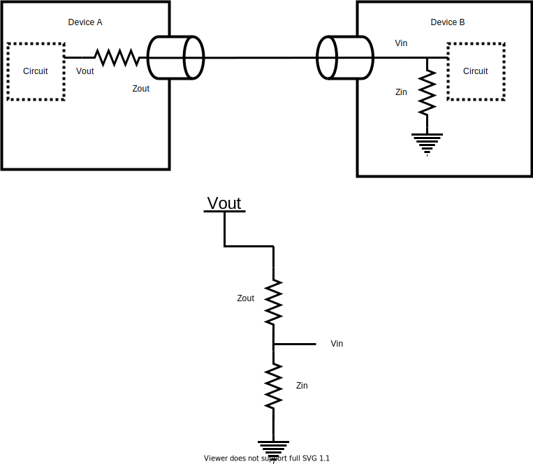

# Procedure

## Impedance

If you studied analog electronics, you've had some experience with impedances and this section may just serve as review.
Impedance is something one considers when dealing with time varying signals is frequency dependent.  It is analogous to resistance for direct current (DC) circuits. It is expressed as a complex number.

$$Z = R + iX(f)$$

For this lab we don't need to consider the consider the frequency dependent part of the lab. (I actually don't know, this is just a test an assumption. If so should we have the students do a calculation?) So we will focus on the real part of the impedance. 

In analog circuits, when you connect two circuits together you typically as trying to pass information about the voltage from one circuit to the next. It would not be good if the second circuit were to affect the voltage signal from the first circuit. To limit the effect of the second circuit on the first you were taught that the first circuit should have a low output impedance, and the second circuit should have high input impedance. 

Here is simplified drawing of connecting two circuits. We want all fo the voltage information from the circuit in device A to be passed the circuit in device B. We want $V_{in}=V_{out}$. We further simplify the model of the two circuits by drawing the device as a simple voltage divider. 

 

:::Question
Given the voltage divider above. Discuss with your partner why we would like $Z_{out} << Z_{in}$ in order for $V_{in} \approx V_{out}$. 
:::

:::Question
What are is the output impedance of a typical PMT? What is the input impedance of the oscilloscope at your desk? Does this fit the requirement of $Z_{out} << Z_{in}$?
:::

:::Exercise
Use a BNC cable to connect the PMT to the oscilloscope. Describe what you see. Now use a BNC "T" to connect to the oscilloscope. Connect the BNC going to the PMT to the oscilloscope to the BNC "T". Lastly, add a $50\Omega$ terminator to the other end of the BNC "T". Now what do you see?
:::

:::Question
With the $50\Omega$ terminator connected, what is the  effective input impedance of the oscilloscope?
:::

:::Question
Discuss with your partner what you think is happening here. Call the your TA over and explain to them what you and your partner have discussed.
:::

## Impedance 2

If you studied analog electronics, you've had some experience with impedances and this section may just serve as review.
Impedance is something one considers when dealing with time varying signals is frequency dependent.  It is analogous to resistance for direct current (DC) circuits. It is expressed as a complex number.

$$Z = R + iX(f)$$

For this lab we don't need to consider the consider the frequency dependent part of the lab. (I actually don't know, this is just a test an assumption. If so should we have the students do a calculation?) So we will focus on the real part of the impedance. 

In analog circuits, when you connect two circuits together you typically as trying to pass information about the voltage from one circuit to the next. It would not be good if the second circuit were to affect the voltage signal from the first circuit. To limit the effect of the second circuit on the first you were taught that the first circuit should have a low output impedance, and the second circuit should have high input impedance. 

Here is simplified drawing of connecting two circuits. We want all fo the voltage information from the circuit in device A to be passed the circuit in device B. We want $V_{in}=V_{out}$. We further simplify the model of the two circuits by drawing the device as a simple voltage divider. 

 

When passing signals from one device to another we often don't 